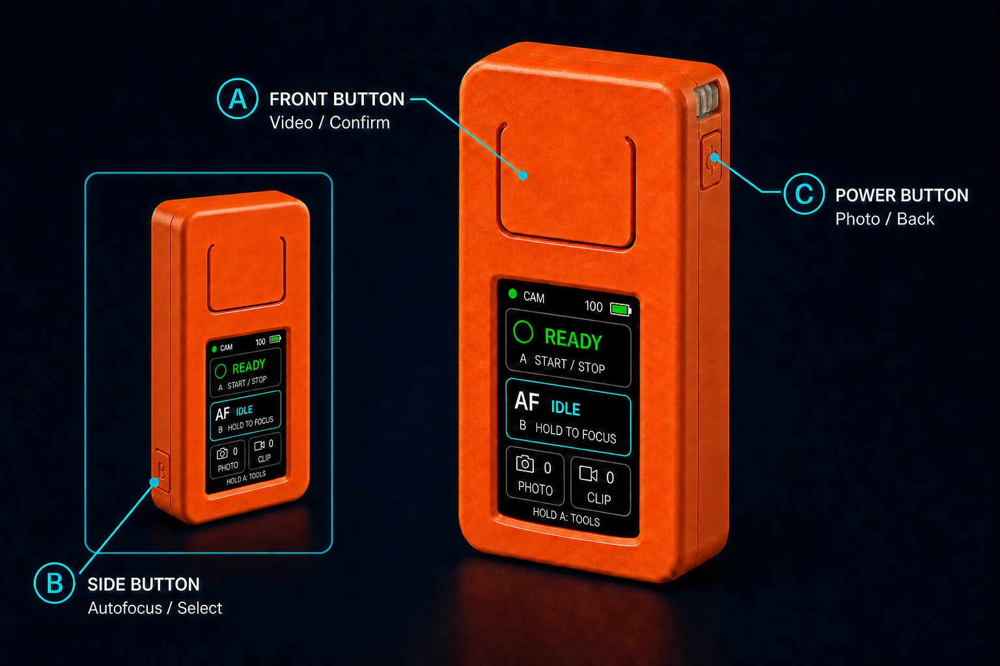
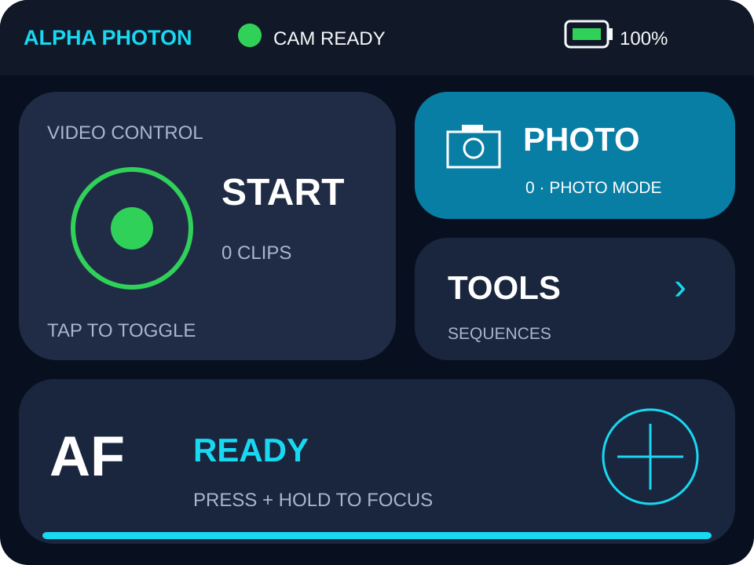

<p align="center"></p>

<p align="center"><a href="#english">English</a> · <a href="#deutsch">Deutsch</a></p>

---

<a id="english"></a>

# English

Alpha Photon turns an M5StickC Plus 1.1 into a compact Bluetooth camera remote with autofocus, photo, video, interval, timelapse and astrophotography BULB sequences. It was developed and hardware-tested with a Sony α6400 using its RMT-P1BT-compatible Bluetooth remote mode. No Wi-Fi or phone is required.

> [!NOTE]
> Alpha Photon is an independent community project and is not affiliated with Sony or M5Stack. Product names are used only to describe compatibility.

## Features

- encrypted BLE pairing and automatic reconnection
- autofocus, photo and video start/stop
- flicker-free graphical display with REC timer, focus and battery status
- session photo/clip counters and automatic display dimming
- unlimited interval shooting
- timelapse with configurable interval and image count
- astro BULB with exposure, pause and image count
- event-driven wait for the camera's `ShutterReady` notification
- decoded BLE diagnostics over USB serial

## Hardware and compatibility

<p align="center"></p>

<p align="center"><sub>Original project illustration of the M5StickC Plus 1.1 form factor and controls; appearance may vary. See the <a href="https://docs.m5stack.com/en/core/m5stickc_plus">official hardware documentation</a>.</sub></p>

- M5StickC Plus 1.1 (ESP32-PICO-D4, 4 MB flash)
- a compatible camera with Bluetooth remote-control mode
- a USB-C **data** cable

Tested: Sony α6400 / ILCE-6400 with firmware 2.00 or newer. Other models may use the same protocol but are not considered supported until tested on hardware.

### Choosing the controller

| Device | Status | Best for | Trade-off |
|---|---|---|---|
| **M5StickC Plus 1.1** | **Primary and hardware-tested** | Small, pocketable remote with physical controls | Small 1.14-inch display and 120 mAh battery |
| [M5Stack CoreS3](https://docs.m5stack.com/en/core/CoreS3) | **Supported and hardware-tested** | Larger 2-inch 320 × 240 touch display and 500 mAh battery | Larger enclosure and touch controls instead of dedicated A/B buttons |

The M5StickC Plus 1.1 remains the recommended first choice: it is compact and its physical buttons work without looking at the screen. CoreS3 is the larger alternative with a modern touch interface, longer runtime and motion-activated display wake. Both targets have been tested with the α6400 and have their own ready-to-flash image in release `v0.2.0`.

<p align="center"></p>

<p align="center"><sub>CoreS3 main screen: video, photo, tools, press-and-hold autofocus, camera connection and battery status.</sub></p>

## Controls

| Button | Main screen |
|---|---|
| Front button, short press | Video start/stop |
| Side button B, hold | Autofocus |
| Power button C, short press | Take photo |
| Front button, hold 1.2 seconds | Open Tools |
| Power button, long press | Power off |

In Tools: the side button changes the selection/value, the front button confirms/starts, and Power goes back. Press the front button to stop a running sequence.

Available tools: `INTERVAL` (unlimited), `TIMELAPSE` (interval + count) and `ASTRO BULB` (exposure + pause + count).

### CoreS3 touch controls

| Touch area | Action |
|---|---|
| Video control | Start/stop recording |
| Photo | Trigger shutter; camera must be in a photo mode |
| AF, press and hold | Hold autofocus; release to stop focusing |
| Tools | Open interval, timelapse and Astro BULB |
| Lift or move the device | Restore display brightness after dimming |

The camera decides how the shutter command is interpreted. In Movie/S&amp;Q mode, or with `Movie w/ Shutter` enabled, tapping Photo may start video instead of taking a still image. Switch the camera to `M`, `A`, `S`, `P` or another still-photo mode for photos.

## Pair the camera

On an α6400:

1. `MENU → Network → Bluetooth Settings → Bluetooth Function → On`
2. `MENU → Network → Bluetooth Remote Ctrl → On`
3. `MENU → Network → Bluetooth Settings → Pairing`
4. Power on Alpha Photon and confirm the camera's pairing dialog.

The bond is stored on the ESP32. Later starts reconnect automatically.

### Switching between controllers

Each controller has its own Bluetooth identity and stores its own bond. A CoreS3 therefore cannot reuse the M5StickC's bond. Only power on the controller you want to use; the camera accepts only one active Bluetooth remote connection.

Sony's α6400 documentation does not state whether multiple remote bonds are retained. Pairing a second controller may replace the first one. When switching devices:

1. power off the controller that is currently connected;
2. power on the controller you want to use and wait for automatic reconnection;
3. if it does not connect, open the camera's pairing screen and pair it again;
4. confirm the Bluetooth dialog on the camera.

Avoid `Reset Network Settings` during a normal controller change. Sony recommends it only for troubleshooting, and it removes pairing/network information. See [Sony's official α6400 Bluetooth remote instructions](https://helpguide.sony.net/ilc/1810/v1/de/contents/TP0002407921.html).

## Install a release (no source build)

Download the image for **your** controller and its matching checksum from the [latest release](https://github.com/fellpower/AlphaPhoton/releases/latest):

- `alpha-photon-m5stickc-plus-1.1-v0.2.0.bin` — M5StickC Plus 1.1
- `alpha-photon-m5stack-cores3-v0.2.0.bin` — M5Stack CoreS3
- matching `.sha256` file — optional integrity check

> [!WARNING]
> The images are device-specific. Do not flash the CoreS3 image to a Stick or the Stick image to a CoreS3.

### 1. Install the USB driver if required

The M5StickC Plus 1.1 uses an FTDI USB serial interface. Install the driver linked in the [official M5Stack documentation](https://docs.m5stack.com/en/core/m5stickc_plus), then reconnect the stick. On Windows it should appear as `USB Serial Port (COMx)`. CoreS3 uses the ESP32-S3 native USB interface and normally needs no separate driver on current operating systems.

### 2. Install esptool

Install [Python](https://www.python.org/downloads/) and run:

```bash
python -m pip install --upgrade esptool
```

### 3. Find the port

- Windows: Device Manager → Ports, for example `COM4`
- macOS: usually `/dev/cu.usbserial-*`
- Linux: usually `/dev/ttyUSB0`

Close PlatformIO, serial monitors, M5Burner or other programs using that port.

### 4. Flash the merged image

#### M5StickC Plus 1.1

Windows example:

```powershell
python -m esptool --chip esp32 --port COM4 --baud 460800 write_flash 0x0 .\alpha-photon-m5stickc-plus-1.1-v0.2.0.bin
```

macOS/Linux example:

```bash
python3 -m esptool --chip esp32 --port /dev/ttyUSB0 --baud 460800 write_flash 0x0 ./alpha-photon-m5stickc-plus-1.1-v0.2.0.bin
```

#### M5Stack CoreS3

Windows example:

```powershell
python -m esptool --chip esp32s3 --port COM13 --baud 1500000 write_flash 0x0 .\alpha-photon-m5stack-cores3-v0.2.0.bin
```

macOS/Linux example (replace the port if necessary):

```bash
python3 -m esptool --chip esp32s3 --port /dev/ttyACM0 --baud 1500000 write_flash 0x0 ./alpha-photon-m5stack-cores3-v0.2.0.bin
```

Both release files are complete bootable images and must be written at offset `0x0`.

### Boot/download mode

On the Stick, normally **no BOOT button is required**. The built-in FTDI interface automatically resets the ESP32 into download mode. The large front button is an application button, not a BOOT button.

On CoreS3, automatic download mode normally works as well. If it does not, hold the bottom `RST` button for about three seconds until the green LED lights, release it, and use the newly appearing serial port.

If esptool remains at `Connecting...`:

1. close every program using the serial port;
2. unplug USB, power-cycle the stick, and reconnect it with a known data cable;
3. retry at `--baud 115200`;
4. reinstall the FTDI driver if no serial port appears.

Flashing replaces the installed firmware. BLE pairing data may need to be recreated if the flash was erased separately.

## Build from source

Install [PlatformIO](https://platformio.org/) and run:

```powershell
pio run -e m5stickc-plus-11
pio device list
pio run -e m5stickc-plus-11 --target upload --upload-port COM4
pio device monitor --port COM4 --baud 115200 --filter time
```

CoreS3:

```powershell
pio run -e m5stack-cores3
pio device list
pio run -e m5stack-cores3 --target upload --upload-port COM13
pio device monitor --port COM13 --baud 115200 --filter time
```

Port names vary. If the CoreS3 does not enter download mode automatically, hold its bottom `RST` button for about three seconds until the green LED lights, then release it and use the newly appearing serial port.

## Astro/BULB

Set the camera to photo mode, `M`, and turn shutter speed past `30″` to `BULB`. Set aperture, ISO and preferably manual focus. Disable silent shooting and continuous/bracketing modes if BULB is unavailable.

The α6400 uses a Bluetooth toggle sequence: one full click opens the shutter, a second closes it. Alpha Photon waits for the configured exposure between those clicks, then waits for `02 A0 00` (`ShutterReady`) before starting the extra pause. This also accommodates in-camera long-exposure noise reduction.

## Protocol and references

- Service `8000ff00-ff00-ffff-ffff-ffffffffffff`
- commands on `FF01`, camera notifications on `FF02`
- [Freemote](https://github.com/coral/freemote)
- [α-Remote](https://github.com/Staacks/alpharemote)
- [Furble](https://github.com/gkoh/furble)
- [Alpha Fairy](https://github.com/frank26080115/alpha-fairy)
- [α6400 Bluetooth remote help](https://helpguide.sony.net/ilc/1810/v1/de/contents/TP0002407921.html)

## License and acknowledgements

Alpha Photon is released under the [MIT License](LICENSE). Copyright © 2026 Alpha Photon contributors. See [NOTICE](NOTICE) for acknowledgements and upstream project references, including Alpha Fairy by Frank Zhao.

<p align="right"><a href="#english">Back to language selection</a></p>

---

<a id="deutsch"></a>

# Deutsch

Alpha Photon verwandelt einen M5StickC Plus 1.1 in eine kompakte Bluetooth-Kamerafernbedienung mit Autofokus, Foto, Video, Intervall, Zeitraffer und Astro-BULB. Entwickelt und praktisch getestet wurde die Firmware mit einer Sony α6400 im RMT-P1BT-kompatiblen Bluetooth-Fernbedienungsmodus. WLAN oder Smartphone sind nicht erforderlich.

> [!NOTE]
> Alpha Photon ist ein unabhängiges Community-Projekt und steht in keiner Verbindung zu Sony oder M5Stack. Produktnamen dienen ausschließlich der Kompatibilitätsbeschreibung.

## Funktionen

- verschlüsselte BLE-Kopplung und automatische Wiederverbindung
- Autofokus, Foto und Video Start/Stopp
- flackerfreie grafische Anzeige mit REC-Timer, Fokus- und Akkustatus
- Foto-/Clip-Zähler und automatische Display-Abdunklung
- unbegrenzter Intervallmodus
- Zeitraffer mit Intervall und Bildanzahl
- Astro-BULB mit Belichtungszeit, Pause und Bildanzahl
- ereignisgesteuertes Warten auf `ShutterReady`
- dekodierte BLE-Diagnose über USB-Serial

## Hardware und Kompatibilität

<p align="center"></p>

<p align="center"><sub>Eigene Projektillustration der Bauform und Tasten des M5StickC Plus 1.1; das Aussehen kann abweichen. Siehe die <a href="https://docs.m5stack.com/en/core/m5stickc_plus">offizielle Hardware-Dokumentation</a>.</sub></p>

- M5StickC Plus 1.1 (ESP32-PICO-D4, 4 MB Flash)
- kompatible Kamera mit Bluetooth-Fernbedienungsmodus
- USB-C-**Datenkabel**

Getestet: Sony α6400 / ILCE-6400 mit Firmware 2.00 oder neuer. Weitere Modelle gelten erst nach einem Hardwaretest als unterstützt.

### Wahl des Controllers

| Gerät | Status | Besonders geeignet für | Einschränkung |
|---|---|---|---|
| **M5StickC Plus 1.1** | **Primäres und hardwaregetestetes Ziel** | Kleine, handliche Fernbedienung mit echten Tasten | Kleines 1,14-Zoll-Display und 120-mAh-Akku |
| [M5Stack CoreS3](https://docs.m5stack.com/en/core/CoreS3) | **Unterstützt und hardwaregetestet** | Größeres 2-Zoll-Touchdisplay mit 320 × 240 Pixeln und 500-mAh-Akku | Größeres Gehäuse und Touchbedienung statt eigener A-/B-Tasten |

Der M5StickC Plus 1.1 bleibt die empfohlene erste Wahl: Er ist kompakt und seine echten Tasten lassen sich ohne Blick auf das Display bedienen. Der CoreS3 ist die größere Alternative mit moderner Touchoberfläche, längerer Laufzeit und bewegungsaktivierter Displayaufhellung. Beide Ziele wurden mit der α6400 getestet und besitzen im Release `v0.2.0` jeweils ein eigenes, direkt flashbares Image.

<p align="center"></p>

<p align="center"><sub>CoreS3-Hauptansicht: Video, Foto, Tools, Autofokus durch Gedrückthalten sowie Kamera- und Akkustatus.</sub></p>

## Bedienung

| Taste | Hauptansicht |
|---|---|
| Große Fronttaste kurz | Video Start/Stopp |
| Seitentaste B halten | Autofokus |
| Power-Taste C kurz | Foto |
| Fronttaste 1,2 Sekunden halten | Tools öffnen |
| Power-Taste lang | Ausschalten |

In Tools ändert die Seitentaste Auswahl/Wert, die Fronttaste bestätigt/startet und Power geht zurück. Während einer Sequenz stoppt die Fronttaste.

Verfügbare Modi: `INTERVAL` (unbegrenzt), `TIMELAPSE` (Intervall + Anzahl) und `ASTRO BULB` (Belichtung + Pause + Anzahl).

### CoreS3-Touchbedienung

| Touchfläche | Aktion |
|---|---|
| Video | Aufnahme starten/stoppen |
| Photo | Auslöser; die Kamera muss in einem Fotomodus stehen |
| AF gedrückt halten | Autofokus halten; zum Beenden loslassen |
| Tools | Intervall, Timelapse und Astro-BULB öffnen |
| Gerät anheben oder bewegen | Display nach dem Dimmen wieder aufhellen |

Die Kamera entscheidet, wie sie den Auslösebefehl interpretiert. Im Film-/S&amp;Q-Modus oder bei aktiviertem `Film mit Verschluss` kann Photo eine Videoaufnahme statt eines Standbilds starten. Für Fotos die Kamera auf `M`, `A`, `S`, `P` oder einen anderen Fotomodus stellen.

## Kamera koppeln

1. `MENU → Netzwerk → Bluetooth-Einstlg. → Bluetooth-Funktion → Ein`
2. `MENU → Netzwerk → Bluetooth-Fernbed. → Ein`
3. `MENU → Netzwerk → Bluetooth-Einstlg. → Kopplung`
4. Alpha Photon einschalten und den Kopplungsdialog bestätigen.

Die Bindung bleibt im ESP32 gespeichert; spätere Starts verbinden automatisch.

### Zwischen Controllern wechseln

Jeder Controller besitzt eine eigene Bluetooth-Identität und speichert seine eigene Bindung. Ein CoreS3 kann die Bindung des M5StickC daher nicht übernehmen. Nur den Controller einschalten, der verwendet werden soll; die Kamera erlaubt nur eine aktive Bluetooth-Fernbedienungsverbindung.

Die Dokumentation der α6400 sagt nicht eindeutig, ob mehrere Fernbedienungsbindungen gespeichert bleiben. Das Koppeln eines zweiten Controllers kann deshalb die erste Bindung ersetzen. Beim Wechsel:

1. den aktuell verbundenen Controller ausschalten;
2. den gewünschten Controller einschalten und die automatische Verbindung abwarten;
3. falls keine Verbindung entsteht, an der Kamera den Kopplungsbildschirm öffnen und erneut koppeln;
4. den Bluetooth-Dialog der Kamera bestätigen.

`Netzw.einst. zurücks.` nicht für einen normalen Controllerwechsel verwenden. Sony empfiehlt die Funktion nur zur Fehlerbehebung; dabei gehen Kopplungs- und Netzwerkinformationen verloren. Siehe [Sonys Anleitung zur Bluetooth-Fernbedienung](https://helpguide.sony.net/ilc/1810/v1/de/contents/TP0002407921.html).

## Release installieren (ohne Quellcode-Build)

Das Image für den **eigenen** Controller und die zugehörige Prüfsumme von der [neuesten Release-Seite](https://github.com/fellpower/AlphaPhoton/releases/latest) herunterladen:

- `alpha-photon-m5stickc-plus-1.1-v0.2.0.bin` — M5StickC Plus 1.1
- `alpha-photon-m5stack-cores3-v0.2.0.bin` — M5Stack CoreS3
- passende `.sha256`-Datei — optionale Integritätsprüfung

> [!WARNING]
> Die Images sind gerätespezifisch. Das CoreS3-Image nicht auf den Stick und das Stick-Image nicht auf den CoreS3 flashen.

### 1. USB-Treiber installieren, falls erforderlich

Der M5StickC Plus 1.1 verwendet eine FTDI-USB-Seriell-Schnittstelle. Den Treiber aus der [offiziellen M5Stack-Dokumentation](https://docs.m5stack.com/en/core/m5stickc_plus) installieren und den Stick neu verbinden. Unter Windows erscheint er als `USB Serial Port (COMx)`. Der CoreS3 verwendet die native USB-Schnittstelle des ESP32-S3 und benötigt auf aktuellen Betriebssystemen normalerweise keinen separaten Treiber.

### 2. esptool installieren

[Python](https://www.python.org/downloads/) installieren und ausführen:

```bash
python -m pip install --upgrade esptool
```

### 3. Port ermitteln

- Windows: Geräte-Manager → Anschlüsse, beispielsweise `COM4`
- macOS: meistens `/dev/cu.usbserial-*`
- Linux: meistens `/dev/ttyUSB0`

PlatformIO, serielle Monitore, M5Burner und andere Programme schließen, die den Port verwenden.

### 4. Komplett-Image flashen

#### M5StickC Plus 1.1

Windows:

```powershell
python -m esptool --chip esp32 --port COM4 --baud 460800 write_flash 0x0 .\alpha-photon-m5stickc-plus-1.1-v0.2.0.bin
```

macOS/Linux:

```bash
python3 -m esptool --chip esp32 --port /dev/ttyUSB0 --baud 460800 write_flash 0x0 ./alpha-photon-m5stickc-plus-1.1-v0.2.0.bin
```

#### M5Stack CoreS3

Windows:

```powershell
python -m esptool --chip esp32s3 --port COM13 --baud 1500000 write_flash 0x0 .\alpha-photon-m5stack-cores3-v0.2.0.bin
```

macOS/Linux (Port bei Bedarf ersetzen):

```bash
python3 -m esptool --chip esp32s3 --port /dev/ttyACM0 --baud 1500000 write_flash 0x0 ./alpha-photon-m5stack-cores3-v0.2.0.bin
```

Beide Release-Dateien sind vollständige, bootfähige Images und müssen an Offset `0x0` geschrieben werden.

### Boot-/Download-Modus

Beim Stick ist normalerweise **kein BOOT-Taster erforderlich**. Die eingebaute FTDI-Schnittstelle setzt den ESP32 beim Flashen automatisch in den Download-Modus. Die große Fronttaste ist eine Anwendungstaste und keine BOOT-Taste.

Auch der CoreS3 wechselt normalerweise automatisch in den Downloadmodus. Falls das nicht funktioniert, die untere `RST`-Taste ungefähr drei Sekunden halten, bis die grüne LED leuchtet. Dann loslassen und den neu erschienenen seriellen Port verwenden.

Falls esptool bei `Connecting...` stehen bleibt:

1. alle Programme schließen, die den seriellen Port verwenden;
2. USB trennen, Stick aus-/einschalten und mit einem sicheren Datenkabel neu verbinden;
3. erneut mit `--baud 115200` versuchen;
4. den FTDI-Treiber neu installieren, falls kein Port erscheint.

Das Flashen ersetzt die installierte Firmware. Wenn der Flash zuvor separat gelöscht wurde, muss Bluetooth eventuell neu gekoppelt werden.

## Aus Quellcode bauen

[PlatformIO](https://platformio.org/) installieren und ausführen:

```powershell
pio run -e m5stickc-plus-11
pio device list
pio run -e m5stickc-plus-11 --target upload --upload-port COM4
pio device monitor --port COM4 --baud 115200 --filter time
```

CoreS3:

```powershell
pio run -e m5stack-cores3
pio device list
pio run -e m5stack-cores3 --target upload --upload-port COM13
pio device monitor --port COM13 --baud 115200 --filter time
```

Portnamen können abweichen. Falls der CoreS3 nicht automatisch in den Downloadmodus wechselt, die untere `RST`-Taste ungefähr drei Sekunden halten, bis die grüne LED leuchtet. Anschließend loslassen und den neu erschienenen seriellen Port verwenden.

## Astro/BULB

Kamera auf Fotomodus und `M` stellen, Verschlusszeit über `30″` hinaus auf `BULB` drehen sowie Blende, ISO und vorzugsweise manuellen Fokus einstellen. Falls BULB fehlt, geräuschlose Aufnahme und Serien-/Reihenmodi deaktivieren.

Die α6400 verwendet per Bluetooth eine Toggle-Sequenz: Ein vollständiger Klick öffnet, ein zweiter schließt den Verschluss. Alpha Photon wartet dazwischen die eingestellte Belichtungszeit und danach auf `02 A0 00` (`ShutterReady`). Erst anschließend läuft die zusätzliche Pause. So wird auch die kamerainterne Langzeit-Rauschminderung berücksichtigt.

## Protokoll und Referenzen

- Service `8000ff00-ff00-ffff-ffff-ffffffffffff`
- Befehle über `FF01`, Kamerastatus über `FF02`
- [Freemote](https://github.com/coral/freemote)
- [α-Remote](https://github.com/Staacks/alpharemote)
- [Furble](https://github.com/gkoh/furble)
- [Alpha Fairy](https://github.com/frank26080115/alpha-fairy)
- [α6400: Bluetooth-Fernbedienung](https://helpguide.sony.net/ilc/1810/v1/de/contents/TP0002407921.html)
- [α6400: Bulb-Aufnahme](https://helpguide.sony.net/ilc/1810/v1/de/contents/TP0002274964.html)

## Lizenz und Danksagungen

Alpha Photon wird unter der [MIT-Lizenz](LICENSE) veröffentlicht. Copyright © 2026 Alpha Photon contributors. Danksagungen und Hinweise zu den als Referenz verwendeten Projekten – darunter Alpha Fairy von Frank Zhao – stehen in [NOTICE](NOTICE).

<p align="right"><a href="#english">Zur Sprachauswahl</a></p>
