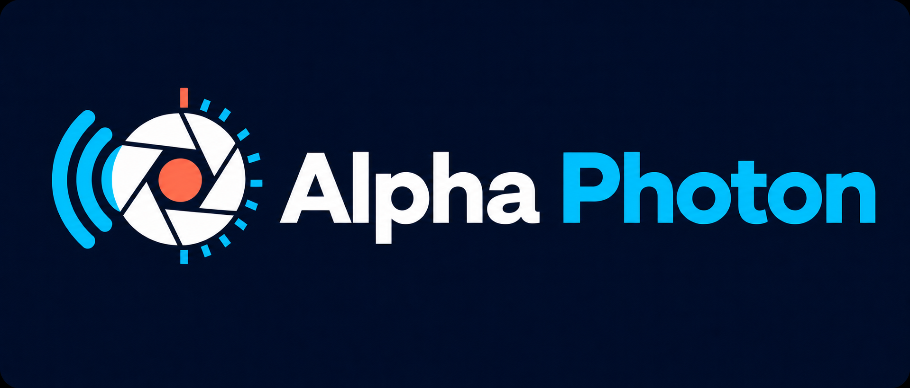

<p align="center"></p>

<p align="center">Bluetooth-Kamerafernbedienung mit Autofokus, Foto, Video, Intervall, Zeitraffer und BULB-Astroserien für den M5StickC Plus 1.1.</p>

## Überblick

Alpha Photon verwandelt einen M5StickC Plus 1.1 in eine kompakte BLE-Fernbedienung. Entwickelt und praktisch getestet wurde die Firmware mit einer Sony α6400 und deren Bluetooth-Fernbedienungsmodus (RMT-P1BT-Protokoll). Sie funktioniert ohne WLAN und Smartphone.

> [!NOTE]
> Alpha Photon ist ein unabhängiges Community-Projekt und steht in keiner Verbindung zu Sony oder M5Stack. Produkt- und Markennamen dienen ausschließlich der Kompatibilitätsbeschreibung.

## Funktionen

- verschlüsselte BLE-Kopplung und automatische Wiederverbindung
- Autofokus, Foto und Video Start/Stopp
- flackerfreie grafische Anzeige mit REC-Timer, Fokusstatus und Akkustand
- Foto- und Clip-Zähler sowie automatische Display-Abdunklung
- unbegrenzter Intervallmodus
- Zeitraffer mit Intervall und Bildanzahl
- Astro-BULB mit Belichtungszeit, Pause und Bildanzahl
- ereignisgesteuertes Warten auf `ShutterReady`
- serielle Diagnose mit dekodierten BLE-Nachrichten

## Hardware und Kompatibilität

- M5StickC Plus 1.1 (ESP32-PICO-D4)
- kompatible Kamera mit Bluetooth-Fernbedienungsmodus
- USB-C-Kabel zum Flashen

Getestet: Sony α6400 / ILCE-6400 mit Firmware 2.00 oder neuer. Weitere Modelle können dasselbe Protokoll verwenden, gelten aber erst nach einem praktischen Test als unterstützt.

## Bedienung

| Taste | Hauptansicht |
|---|---|
| Große Fronttaste kurz | Video Start/Stopp |
| Obere Seitentaste halten | Autofokus |
| Power-Taste kurz | Foto |
| Fronttaste 1,2 Sekunden halten | Tools-Menü |
| Power-Taste lang | Gerät ausschalten |

Im Tools-Menü: Seitentaste ändert Auswahl/Wert, Fronttaste bestätigt oder startet, Power geht zurück. Während einer Sequenz stoppt die Fronttaste.

Die Modi sind `INTERVAL` (unbegrenzt), `TIMELAPSE` (Intervall plus Bildanzahl) und `ASTRO BULB` (Belichtungszeit, Pause und Bildanzahl).

## Kamera koppeln

1. `MENU → Netzwerk → Bluetooth-Einstlg. → Bluetooth-Funktion → Ein`
2. `MENU → Netzwerk → Bluetooth-Fernbed. → Ein`
3. `MENU → Netzwerk → Bluetooth-Einstlg. → Kopplung`
4. Stick einschalten und den Kopplungsdialog bestätigen

Die Bindung wird im ESP32 gespeichert. Danach verbindet sich Alpha Photon automatisch.

## Astro/BULB

1. Kamera in den Fotomodus und Moduswahlrad auf `M` stellen.
2. Verschlusszeit über `30″` hinaus auf `BULB` drehen.
3. Blende, ISO und Fokus einstellen; für Sterne empfiehlt sich manueller Fokus.
4. `Geräuschlose Auf.` sowie Serien-/Reihenmodi deaktivieren, falls `BULB` fehlt.

Die α6400 nutzt über Bluetooth eine Toggle-Sequenz: Ein vollständiger Klick öffnet den Verschluss, ein zweiter schließt ihn. Alpha Photon wartet dazwischen die gewählte Belichtungszeit und danach auf `02 A0 00` (`ShutterReady`). Erst anschließend läuft die zusätzliche Pause. Damit wird auch die kamerainterne Langzeit-Rauschminderung berücksichtigt.

## Bauen und flashen

Benötigt werden [PlatformIO](https://platformio.org/) und der passende USB-Treiber.

```powershell
pio run
pio device list
pio run --target upload --upload-port COM4
pio device monitor --port COM4 --baud 115200 --filter time
```

`COM4` ist nur ein Beispiel; den tatsächlichen Port vorher prüfen.

## Serielle Diagnose

| Zeichen | Aktion |
|---|---|
| `f` | Autofokus drücken |
| `u` | Auslöser freigeben |
| `s` | Foto |
| `r` | Video Start/Stopp |
| `x` | BLE-Bindungen löschen |
| `?` | Hilfe |

## BLE-Protokoll

- Service: `8000ff00-ff00-ffff-ffff-ffffffffffff`
- Befehle: `FF01`
- Kamerastatus: `FF02`

| Bytes | Bedeutung |
|---|---|
| `01 06` / `01 07` | Half Up / Half Down |
| `01 08` / `01 09` | Full Up / Full Down |
| `01 0E` / `01 0F` | Record Up / Record Down |
| `02 3F 20` | Fokus gefunden |
| `02 A0 20` / `02 A0 00` | Verschluss aktiv / bereit |
| `02 D5 20` / `02 D5 00` | Aufnahme gestartet / gestoppt |

## Projektstruktur

```text
assets/                       README-Grafiken
include/SonyBleRemote.h       BLE-Verbindung und Kameraaktionen
include/SonyRemoteProtocol.h  Protokollkonstanten
src/SonyBleRemote.cpp         BLE- und Auslöserimplementierung
src/SonyRemoteProtocol.cpp    Statusdekodierung
src/main.cpp                  UI, Tasten und Sequenzen
platformio.ini                Build-Konfiguration
```

## Referenzen

- [Freemote](https://github.com/coral/freemote)
- [α-Remote](https://github.com/Staacks/alpharemote)
- [Furble](https://github.com/gkoh/furble)
- [Alpha Fairy](https://github.com/frank26080115/alpha-fairy)
- [α6400: Bluetooth-Fernbedienung](https://helpguide.sony.net/ilc/1810/v1/de/contents/TP0002407921.html)
- [α6400: Bulb-Aufnahme](https://helpguide.sony.net/ilc/1810/v1/de/contents/TP0002274964.html)
